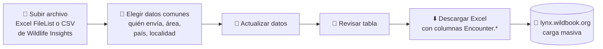

<!-- README.md is generated from README.Rmd. Please edit that file -->

<div align="center">

# 🐾 WBIL

### Wildbook Iberian Lynx · preparación de datos de fototrampeo para Wildbook

**App Shiny que convierte los listados de imágenes de cámaras trampa de lince ibérico (*Lynx pardinus*) en el Excel de carga masiva de [lynx.wildbook.org](https://lynx.wildbook.org)**

[](https://ai4lynx.shinyapps.io/WBIL/)
[](https://www.r-project.org/)
[](https://shiny.posit.co/)
[](https://thinkr-open.github.io/golem/)
[](https://rstudio.github.io/renv/)
[](https://lifecycle.r-lib.org/articles/stages.html#experimental)
[](LICENSE.md)

### 👉 [Abrir la app](https://ai4lynx.shinyapps.io/WBIL/)

</div>

---

## 📖 Contenido

- [Por qué existe](#-por-qué-existe)
- [Cómo funciona](#%EF%B8%8F-cómo-funciona)
- [Las cuatro herramientas](#-las-cuatro-herramientas)
- [Formato de los archivos de entrada](#-formato-de-los-archivos-de-entrada)
- [Ejecutarla en local](#-ejecutarla-en-local)
- [Configuración](#%EF%B8%8F-configuración)
- [Estructura del proyecto](#-estructura-del-proyecto)
- [Despliegue](#%EF%B8%8F-despliegue)
- [Licencia y autoría](#-licencia-y-autoría)

---

## 🌍 Por qué existe

El seguimiento del lince ibérico genera miles de fotos de cámaras trampa que acaban en **[Wildbook](https://lynx.wildbook.org)**, la plataforma de identificación individual. Para subirlas en bloque, Wildbook pide un Excel con columnas `Encounter.*` muy concretas: fecha descompuesta, coordenadas, localidad, quién envía, especie…

Rellenar ese Excel a mano en cada revisión de cámaras es lento y propenso a errores. **WBIL lo automatiza**: subes el listado que ya tienes, eliges los datos comunes del envío y descargas el Excel listo para Wildbook.

Surgió como posible app web de la **acción A8 del proyecto LIFE LynxConnect**.

## ⚙️ Cómo funciona

Todas las pestañas siguen el mismo flujo:



## 🧰 Las cuatro herramientas

| | Pestaña | Entrada | Salida |
|---|----|----|----|
| 👁️ | **Wildlife Insight** | CSV de *deployments* + CSV de *imágenes* de Wildlife Insights | `WI-WB-<fecha>.xlsx` |
| 📤 | **FilelistCreator Revisiones** | Excel de FileList de una revisión de cámaras | `FL-WB-<fecha>.xlsx` |
| 📘 | **FilelistCreator Catálogos** | Excel de FileList de un catálogo de individuos | `WildbookCatalogo<fecha>.xlsx` |
| 📷 | **Filelist Personalizada** | Excel de FileList con una carpeta por individuo | `FL-CLM-<fecha>.xlsx` (resumen por individuo) |

<details open>
<summary><b>👁️ Wildlife Insight</b></summary>
<br>

Cruza las imágenes con sus *deployments* (`deployment_id`) y **se queda solo con las identificadas como `Iberian Lynx`**. De cada imagen saca fecha y hora, coordenadas y localidad (el `deployment_id`), y añade una columna `Codigo.descarga` con la orden `gsutil` para bajar la imagen al directorio que indiques.

</details>

<details open>
<summary><b>📤 FilelistCreator Revisiones</b></summary>
<br>

Para imágenes de una revisión de cámaras. Usa las columnas `Name` y `Created` del Excel de FileList: el nombre pasa a ser el *media asset* (`Encounter.mediaAsset1`) y la fecha de creación se descompone en día, mes, año, hora y minutos. Localidad, latitud y longitud se escriben a mano y se aplican a todas las filas.

</details>

<details open>
<summary><b>📘 FilelistCreator Catálogos</b></summary>
<br>

Para fotos de catálogo, donde el nombre del archivo empieza por el nombre del individuo. Saca el ID del individuo del principio de `Name` (hasta el primer espacio o guion bajo) y le añade el sufijo del área (`_And`, `_CdM`) para el *nickname* (`MarkedIndividual.nickname`).

</details>

<details open>
<summary><b>📷 Filelist Personalizada</b></summary>
<br>

Toma el nivel de carpeta más profundo (una carpeta por individuo), ordena las imágenes por fecha y **agrupa en un solo evento las que están a menos de 60 segundos entre sí**. Devuelve una fila por evento con `Codigo` (el código de cámara sacado de la ruta), `Individuo`, `Fecha` y `Hora`.

</details>

### Columnas que genera para Wildbook

`Encounter.mediaAsset1` · `Encounter.day` / `month` / `year` / `hour` / `minutes` · `Encounter.decimalLatitude` / `decimalLongitude` · `Encounter.verbatimLocality` · `Encounter.locationID` · `Encounter.country` · `Encounter.submitterID` · `Encounter.genus` = `Lynx` · `Encounter.specificEpithet` = `pardinus` · `Encounter.individualID` y `MarkedIndividual.nickname` (catálogos)

## 📄 Formato de los archivos de entrada

| Archivo | Columnas necesarias |
|---|---|
| **Excel de FileList** | `Name`, `Created` (fecha `dd/mm/aaaa hh:mm:ss`). La pestaña personalizada usa además `Folder`, `Folder Level` y `Path` |
| **CSV de imágenes** (Wildlife Insights) | `deployment_id`, `common_name`, `location`, `timestamp` |
| **CSV de deployments** (Wildlife Insights) | `deployment_id`, `latitude`, `longitude` |

> 📦 Tamaño máximo de subida: **100 MB**.

## 🚀 Ejecutarla en local

Necesitas **R ≥ 4.3**. Las dependencias están fijadas con [renv](https://rstudio.github.io/renv/).

```r
# En la carpeta del proyecto
install.packages("renv")
renv::restore()

# Arrancar la app
golem::run_dev()   # modo desarrollo (dev/run_dev.R)
# o bien
source("app.R")    # igual que en shinyapps.io
```

## 🛠️ Configuración

Las listas de los desplegables (quién envía, área y país) están en [`R/config.R`](R/config.R):

```r
usuarios   <- c("FCDBH Andujar", "ijimenez_And", "ijimenez_CdM")
paises     <- c("Spain", "Portugal")
locationID <- c("Andújar-Cardeña", "Campo de Montiel")
```

Para añadir un usuario o un área nuevos, edita ese archivo. Los `submitterID` de la pestaña de catálogos (`Andujar_admin`, `JEX_admin`, `CdM_admin`) están en [`R/mod_Catalog.R`](R/mod_Catalog.R).

## 📁 Estructura del proyecto

Es un paquete R creado con [golem](https://thinkr-open.github.io/golem/): cada pestaña es un módulo Shiny independiente.

```text
WBIL/
├── R/
│   ├── app_ui.R, app_server.R          # Menú lateral (shinydashboard) y enlace de módulos
│   ├── mod_WildlifeInsight.R           # 👁️ Wildlife Insight
│   ├── mod_Deployment.R                # 📤 FilelistCreator Revisiones
│   ├── mod_Catalog.R                   # 📘 FilelistCreator Catálogos
│   ├── mod_Custom1.R                   # 📷 Filelist Personalizada
│   ├── mod_WildlifeInsightDescarga.R   # Pestaña de créditos
│   └── config.R                        # Usuarios, países y áreas
├── inst/app/www/                       # CSS, JS y favicon
├── dev/                                # Scripts de golem (arranque, desarrollo, despliegue)
├── tests/testthat/                     # Tests
├── renv.lock                           # Dependencias fijadas
└── app.R                               # Punto de entrada para shinyapps.io
```

**Stack:** `shiny` · `shinydashboard` · `golem` · `dplyr` · `lubridate` · `stringr` · `readxl` · `writexl` · `DT`

## ☁️ Despliegue

La app está publicada en **shinyapps.io**, en la cuenta `ai4lynx`. Para publicar una versión nueva:

```r
rsconnect::deployApp()
```

## 📜 Licencia y autoría

Licencia **MIT**. Ver [LICENSE.md](LICENSE.md).

---

<div align="center">

Hecha por **[Antón Álvarez](https://github.com/antonalvarezbc)** para el seguimiento del lince ibérico 🐆

</div>
